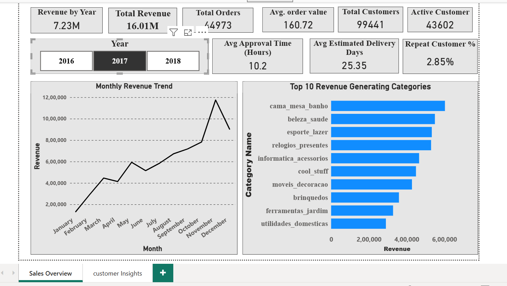
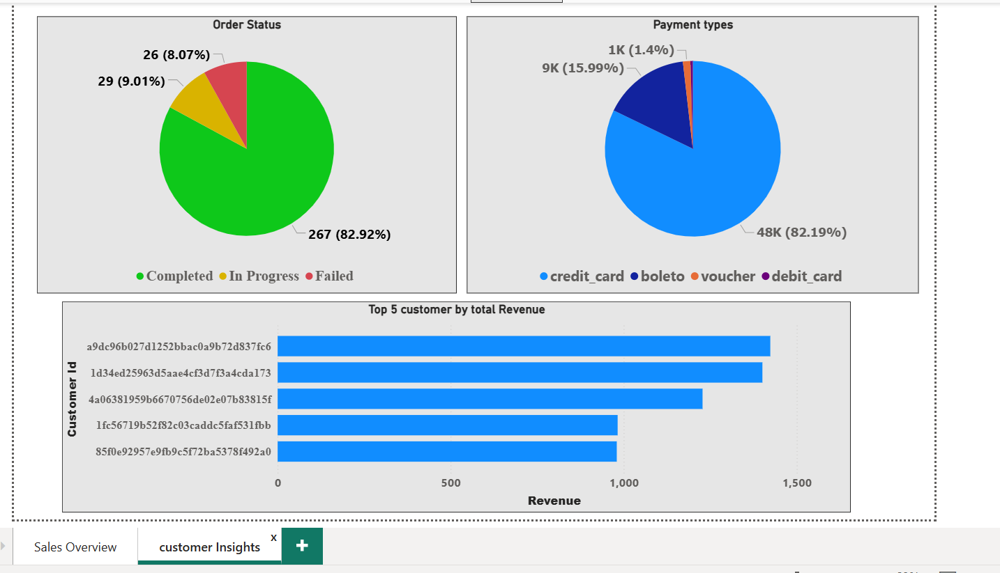

  # E-Commerce Data Analysis Project
  
  ## Project Overview
  
  This project focus on analyzing an e-commerce dataset using SQL,Power Bi,Excel to extract meaningful business insights.
  The goal is to understand customer behavior, sales performance, and operational efficiency.
  
  ## Objectives
 * Identify top-selling product categories
 * Analyze customer purchase behavior
 * Calculate total revenue and growth trends
 * Find repeat customers
 * To analyze delivery performance 

  
  ##  Dataset Information
  * source : kaggle 
  The dataset contains the following tables:
  
  * **customers** : customer details
  * **orders** : order information & status
  * **order_items** : product-level order data
  * **payment** : payment transactions
  * **product** : product & category details
 
  ##  Tools & Technlogy Used
  
  * SQL (MySQL)
  * Power bi
  * GitHub
  * Ms-Excel 
    
  ##  Business Problems Solved
  
  ### 1. Overall Performance Analysis
  
  * Total number of orders
  * Total customers
  * Order status distribution
  * Delivery performance
  * Average order value
  
  ### 2. Revenue Analysis
  
  * Category-wise revenue
  * Month-wise revenue trend
  * Top revenue-generating categories
  * Payment method contribution
  
  ### 3. Customer Analysis
  
  * Repeat customers
  * Customer segmentation using RFM (Recency, Frequency, Monetary)
  * active customers 
  
  ### 4. Product Analysis
  
  * Top selling categories
  * Revenue contribution by category
  
  ### 5. Advanced SQL Analysis 
  
  * Customer segmentation using CASE statements
  * Percentage contribution using window functions
  * Order funnel analysis (approved → shipped → delivered)

### 6. Delivery Analysis
  
  * Average Estimated delivery time
  * Avg approval time
  
  ---
  
  ##  Project Files
  
  * queries.sql : All SQL queries used in analysis
  * data folder : CSV Files of  e-commerce dataset
    

##  Dashboard Overview
 Power BI Dashboard file is available in the repository (dashboard.pbix)

### Page 1

### Page 2

  
  ---
   ##  Key Insights
  *  Credit card is the most preferred payment method
  *  Around 90% customers fall into the Lost segment. This is influenced by the dataset timeline (2016–2018), where older         customers naturally appear inactive. However, it still highlights a low repeat purchase behavior in the dataset
  *  A significant number of customers (67,580) are inactive for more than 6 months. This indicates a high customer churn
     rate. A large portion of users are not returning after initial purchase
  *  Most orders are successfully delivered, but a small percentage are canceled
  *  Average estimated delivery time indicates potential logistics improvement
  *  Some product categories generate significantly higher revenue

  ---
  
  ##  Business Recommendations
  
  *  Focus on **repeat customers** with loyalty programs and offers to increase retention
  *  Convert recent and new customers into loyal customers
  *  Re-engagement campaigns should be implemented (email/SMS offers).Discounts and personalized offers can help bring back       **inactive customers**. Focus on improving customer retention strategies
  *  Improve **delivery time** to enhance customer satisfaction
  *  Promote other payment options like wallets/UPI and offer cashback on them.
  *  Reduce cancellations by improving order confirmation & logistics
  *  Invest more in **top-performing categories** to maximize revenue
  *  ## 🚀 Business Recommendations

*  Focus on improving **customer retention** by introducing loyalty programs, rewards, and special offers for repeat customers  
   → Impact: Increases repeat purchase rate and long-term revenue stability  

*  Convert **new and recent customers** into loyal customers through personalized offers

*   
   → Impact: Improves customer lifetime value (CLV)  

*  Implement **re-engagement campaigns** (email/SMS, discounts, personalized recommendations) to bring back inactive customers  
   → Impact: Recovers lost customers and boosts overall sales  

*  Optimize and reduce **delivery time** by improving logistics and shipping processes  
   → Impact: Enhances customer satisfaction and increases repeat purchases  

*  Promote alternative payment methods (wallets/UPI equivalents) with cashback and offers to reduce dependency on credit cards  
   → Impact: Diversifies payment risk and improves user flexibility  

*  Reduce **order cancellations** by improving order confirmation, communication, and logistics coordination  
   → Impact: Increases successful order completion rate  

*  Invest more in **top-performing product categories** through marketing and inventory planning  
   → Impact: Maximizes revenue and business growth  

  ---
  ##  Conclusion
  
  This project demonstrates how raw data can be transformed into actionable business insights using SQL, Power Bi.
  It highlights the importance of data-driven decision-making in e-commerce.
  
  ---
  
  ##  Author
  
  **Rahul Mitan**
  Aspiring Data Analyst
